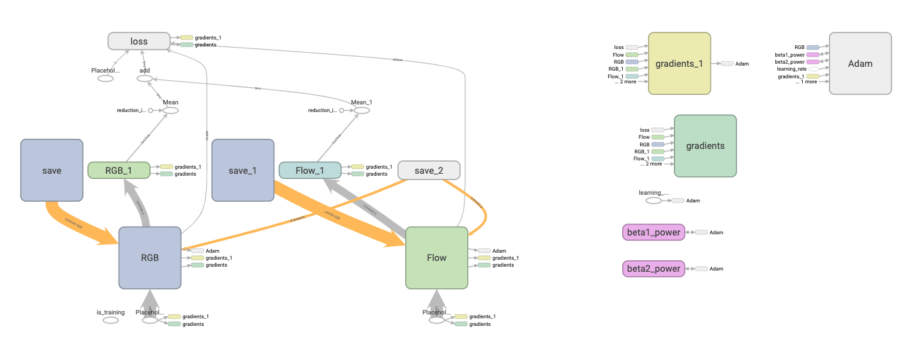

# Training a video classifier

## Overview

The code implemented in the `TechniqueAnalysis` CocoaPod uses a pose estimation machine learning (ML) model to determine body position for images over time, but a purely *algorithmic* approach is used to classify the video.

This has numerous drawbacks, most notably the requirement of the *k-Nearest Neighbors* algorithm to compare an unlabeled sample with **every** labeled item in the dataset to find the best match. Thus, inference time grows proportionally with the dataset size.

The Python code in this directory is an attempt to train an end-to-end ML model such that inference time is **constant**. The code is based on an [Inflated 3D Convnet](https://github.com/deepmind/kinetics-i3d) architecture (i3D) from the paper "[Quo Vadis, Action Recognition? A New Model and the Kinetics Dataset](https://arxiv.org/abs/1705.07750)."

## Background

The i3D model is a version of Inception-v1 with batch normalization which has been pre-trained on ImageNet and then "inflated" from 2 dimensions into 3 dimensions. It was then trained on the massive "Kinetics Human Action Video Dataset."

The i3D model uses a two-stream architecture in which a video is pre-processed into two streams: *RGB* and *optical flow*. There is a separate model for each stream, and the output of the models are combined only at the logit-level. Then, class predictions are formed using the combined logits.


Given the similarity between the Kinetics dataset and the task at hand (classifying videos of people doing exercises), there is a strong opportunity for **transfer learning** using the publicly released i3D model.

## Implementation



I stripped off the last two layers of the i3D model (logits and predictions) and replaced them with similar layers. The new logit-layer has the correct number of `output_channels` for this use case (6 classes). Logits for each stream, *RGB* and *optical flow*, are combined and used to form predictions like in the original implementation.

```
# classes:
bw-squat_correct
bw-squat_not-low
pull-up_chin-below-bar
pull-up_correct
push-up_correct
push-up_upper-body-first
```

The new model was trained on an (unfortunately small) dataset of 128 videos, using 20% of videos as the test dataset and 20% of the remaining videos as a validation dataset. I performed backpropagation on the new layers *only*, relying on the weights and biases of the existing layers to map videos into relevant features.

### Hyperparameters

After trying various hyperparameter combinations for learning rate and regularization strength, the best result came from using:

- An `AdamOptimizer` with learning rate of `5e-4`
- Regularization strength of `0.25` (L<sup>2</sup> norm)

### Other conditions

- Batch size of `1`
- Training generally took about `30 epochs` until the loss plateaued
- Trained using 1 NVIDIA Tesla K80 GPU on Google Cloud Compute

### Results

- In the best case, the average loss of the last 100 iterations was `0.035058`
- Test accuracy reached `69.23%` although this is not particularly significant given the small size of the dataset

## Feasibility

The results of this project are limited by the small dataset size, but with more videos, I believe that a fine-tuned version of the i3D model can achieve much higher test accuracy.

Integrating the end-to-end ML model into a mobile client poses a different challenge. For example, in the realm of iOS, models must be in an acceptable format for **CoreML**. There exist tools such as [tfcoreml](https://github.com/tf-coreml/tf-coreml) for converting a TensorFlow model into a CoreML model, however there are a limited number of ops which are supported for conversion.

At the time of writing this, [tfcoreml](https://github.com/tf-coreml/tf-coreml) does *not* support `Conv3D` or any 3-dimensional operations, meaning it is not yet possible to integrate the i3D model into an iOS application.